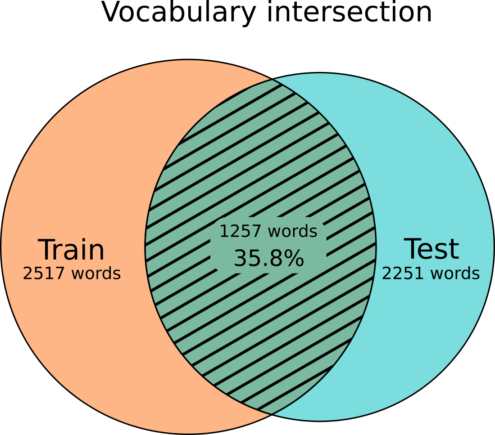

# A VOSK model for the Breton language

## Goal and motivation

During my childhood I've been attending Diwan schools from kindergarten to high-school. Diwan schools follow the national curriculum but classes are taught in a Breton only environment, with the obvious exception of language classes, where the same immersive rule applies to the target language (i.e. English classes are taught in English only). Pupils are also encouraged to speak in Breton during breaks, outside of the classroom.
Today, the number of pupils attending Diwan high-school in Carhaix-Plouguer is around 260.
Since I'm now living nearby, I've been volunteering for a couple of years in this former high-school of mine, helping science teachers (some of them were classmates) with Python programming and other computer related work. I've been running a computer club for high-schoolers on Wednesday afternoon there as well, with 6 pupils attending this year.
Last year I met with an old friend of mine, working for a company dubbing movies in Breton. He told me about his work as a sound engineer and of the hundreds of hours of recorded voice archive with transcription that his company owned. From this conversation sprang the idea to try to build a small STT system as a proof of concept. Although I had no prior knowledge in ASR but with only a CS education and a keen interest in machine learning, I felt excited by the challenge.
We are in no way aiming to build a consumer-ready product. This project is motivated by curiosity, self-education, and the hope to build something useful and freely available for anyone to test.

## A note about the Breton language

The Breton language is a Celtic language (Brittonic subgroup) spoken in the western part of France. It is closely related to Welsh and Cornish, spoken in the United Kingdom.
Breton is classified as "severely endangered" by the UNESCO _Atlas of the World's Languages in Danger_ [^1]
According to a recent survey[^2] the number of Breton speakers today is around 207,000, of which 79% is above 60 years old. Although many people learn the language every year, it is estimated that the overall number of speakers decrease continuously, due the passing away of the elderly.
There are four main dialects in the areas of Leon, Treger, Kernev and Gwened, with the latter being the most distinct to the point of near unintelligibility[^3].
After the French revolution in 1790, the government banned the use of the Breton language in an effort to unify the whole country by imposing the sole use of the French language. From there onward the Breton culture suffered great losses from the government politics, accelerated by popular views associated to French as being "progressive" whereas Breton was seen as "backward-looking".
However, at the end of the 20th century emerged a revitalization movement with the creation of Diwan schools in 1977[^4]. Since their establishment, Diwan schools have provided fully immersive primary school and partially immersive secondary school instruction in Breton for thousands of students across Brittany. This has directly contributed to the growing numbers of school-age speakers of Breton.
In the early 21st century, the [Ofis Publik ar Brezhoneg](https://en.wikipedia.org/wiki/Ofis_Publik_ar_Brezhoneg) ("Public Office for the Breton language") began a campaign to encourage daily use of Breton in the region by both businesses and local communes.

## Possible applications

There is a few shows in Breton on regional TV and on streaming platforms. Some of them provide subtitles translated in French but almost none of them provide Breton subtitles, with the exception of [Brezhoweb](https://www.brezhoweb.bzh/), probably due to lack of human resources. While we are aware that we are far from being able to train a STT system reliable enough on a wide variety of domains, a small model could be tailored for a specific show (with the added voice of the main speakers for exemple). Such a model could then be tested by the person in charge of the transcription to see if it can help reduce the workload. It would be interesting to evaluate how well must a model perform to be actually helpful on such task.

Five community radio stations offer programs in Breton for the whole peninsula. 3 of them broadcast in Breton only and the 2 other mix French and Breton programs[^5]. A STT system could help those radio station search through their databases by extracting keywords in archived radio programs.

"Dastum" is a cultural organization specialized in collecting audio recordings from native speakers. Founded in 1972, its mission is "to collect, protect and promote the cultural heritage of Brittany". Dastum maintains a large archive containing more than 8,000 hours of recordings of traditional music, folk tales, oral histories and interviews from native speakers from the beginning of the last century onward, which are cataloged for public use[^6]. Unfortunately, of the recordings that were digitalized, very few have been transcribed, seriously limiting the searchability of their database.
The biggest difficulty here would be to train a model adapted to the diverse and pronounced accents of old forms of the language, as well as to noisy environments and degraded recordings.

The above cases are still far-reaching and would require much more work to build a bigger model and a UI usable by a non-specialist.
A more realistic and immediately applicable usage would be to host workshops around this technology during Breton classes in Diwan high-school, where I do volunteer work.
With the help of Breton language teachers we could first let the students try the model out and find some of its weaknesses. We could then talk to the students about public domain contribution and ask them to come up with sentences to grow the Common Voice corpus through Mozilla's sentence collector. The teachers participation would guarantee that the sentences are grammatically correct. Students could also volunteer to contribute with their voice if they want.
This kind of workshop could have the added benefit to bring a teenager demographic, often under-represented, to Mozilla's Common Voice.

## Common Voice's Breton dataset analysis

As of today, the Common Voice dataset is by far the most diverse and readily available dataset you can find on the Internet for the Breton language. While it is slowly growing, it is still quite small.
It contains relatively few written sentences with a total of 7831 sentences, of which 9% are duplicates, that leaves 7111 unique sentences.
French words, or even whole sentences, can be found in the corpus. A quick search of the characters 'é' or 'è' (quite common in french but never found in Breton) shows a few French sentences like "Les antiques croyances des peuples amérindiens" or "Légendes ?". You can find some of them in the `reported` set.
MCV11 Breton dataset suffers from a lack of validation, with usually only 2 up votes (or 3 up votes in rare cases). Funnily, the two previous French sentences have been validated with two up votes as well !

To improve the models accuracy, those sentences, along with others, have been manually put in file `blacklisted_sentences.txt` to be filtered out before training. A few speakers have been filtered out as well (found in file `blacklisted_speakers`) on the basis of empty or unintelligible recordings.

### Train dataset

The training set consists of the filtered `train.tsv` dataset, with 7 speakers adding up to 2h07 of audio data. The gender distribution is very skewed as it consists of male speakers exclusively (the gender of 2 of the 7 speakers was unspecified but after listening to the audio recordings it was guessed that they were male).
This corpus is made of 2636 sentences with a vocabulary size of 2517 unique words.

### Test dataset

The test set consists of the filtered `test.tsv` dataset, with 108 speakers (112 before filtering) adding up to 1h53 of audio data. The gender distribution is better than in the training set, but still far from parity, with 29 male speakers (26.9%), 8 female speakers (7.4%) and 75 speakers of unspecified gender (65.7%).
After listening to all speakers with unspecified gender, it was guessed that the actual share of male speakers was 69.4% and 30.6% for female speakers.
In terms of audio data length, the guessed gender distribution is slightly better with 66.3% male audio data and 33.7% female audio data.
This corpus is made of 2101 sentences with a vocabulary size of 2251 unique words.
Only 35.8% of all words (training + test corpora) are found in both dataset's vocabulary, or in other word only 55.8% of the test corpus vocabulary can be found in the train corpus.

## Training setup

Before I ever though about training my own STT model I had the chance to test [VOSK](https://github.com/alphacep/vosk-api) with a French model. I was impressed by its performance, its ease of use as well as the list of supported platforms and programming languages. That naturally led me to experiment with the Kaldi toolkit, as it is the way to build VOSK compatible models.
The recipe used to train the models is derived from `mini_librispeech`. This recipe trains a TDNN-F based chain model using a nnet3 setup, with 3-fold speed-perturbation and many other bells and whistles that are beyond my understanding.
The recipe was modified to run without CUDA (as I don't have a GPU) and the chain model is trained with the script `local/chain/run_tdnn_1j.sh`, as recommended for VOSK, rather than the usual `local/chain2/run_tdnn.sh`.
The training was done on a NUC10i7FN computer and took around 13 hours for each model.

###  Grapheme to phoneme

Kaldi requires a phonetic dictionary or lexicon in the form of a dictionary of every word found in the corpus, with their phonetic transcriptions.
As there is no readily available grapheme-to-phoneme tool for the Breton language, a naive solution based on a simple python dictionary lookup was used instead. Our phonetic alphabet is composed of 40 phonemes that were chosen empirically.
Words with a particular pronunciations as well as foreign words (mostly French and English) were manually added to the file `lexicon_replace.txt`. Words having different dialectal pronunciation were added to `lexicon_add.txt`. Capitalized proper nouns with their specific pronunciation were added to `capitalized.txt`.
Although this method is far from ideal and would need to be improved, it seems to do the trick for our purpose. It works well for KLT (Kernev, Leon and Treger) dialects but is virtually unusable for Gwened dialect.

Example uses of the function `word2phonetic` in script file `libMySTT.py` for words with regular pronunciation :
    >>> word2phonetic("Kemper")
    ['K', 'EH M', 'P', 'EH R']
    >>> word2phonetic("fiziañs")
    ['F', 'I', 'Z', 'I', 'AN', 'S']
    >>> word2phonetic("c'hwec'h")
    ['X', 'W', 'EH X']

## Data preparation

After download, the Common Voice archive must be put in folder `common_voice` and the Python script `unpack.py` must be executed for the `train` and `test` sets.

    $ ./unpack.py train.tsv train
    $ ./unpack.py test.tsv test
    
The `unpack` script will extract the compressed archive and process the given `tsv` file (second argument) to an intermediary data/file structure in the folder name given as third argument.
This intermediary file structure helps to aggregate and process datasets from different sources in an uniform way before transforming everything to the file structure that Kaldi expects, with a single script `build_kaldi_files.py`.
It is comprised of a collection of subfolders that can each be treated as independent subsets. Every subfolder/subset contains 3 files with the same basename :
* a wave file (16bit PCM, 16KHz audio rate, single channel) with many utterances separated by audio silences.
* a text file with the transcribed utterances (one per line)
* a "split" file with start and end time markers for each utterance (in milliseconds)

Rather than merging all data in a single set, `unpack` divide the subsets by speaker-id. `unpack` also discard speakers and sentences found in files `blacklisted_speakers.txt` and `blacklisted_sentences.txt` respectively.

Once the `train` and `test` folder are build by `unpack`, the next stage is to run `build_kaldi_files.py` script for both `train` and `test` folders.
This script applies some spelling corrections to the text files using file `corrected.txt` as a reference. The spelling mistakes were found with the help of [Breton Hunspell](https://github.com/Drouizig/hunspell-br) spell checker by running the script `verify_text_files.py` and were manually added to `corrected.txt`. Other text normalization techniques are applied at this stage : case normalization, acronym identification, proper noun identification, special symbol removal and number to word rewritting.
The whole dataset is then formatted to a Kaldi compatible structure and put in the folder `data`.

    $ ./build_kaldi_files common_voice/train

`build_kaldi_files.py` should be edited at this point to set `BUILD_ML_CORPUS` to `False` before running the script again on the `test` folder.

    $ ./build_kaldi_files common_voice/test

The last step is to copy the `data` folder created by `build_kaldi_files.py` in the `kaldi/egs/br` folder and start Kaldi training as usual.

## Hyperparameters fine-tuning

In order to better adjust the acoustic model's hyperparameters, six models with varying number of TDNN hidden layers and dimensions were compared.
The training of those models were done with the same methodology as previously described.
Due to lack of time I couldn't play with the number of epochs but I hope to try that soon.

The testing was done by decoding the audio files with VOSK, with default parameters (beam=13 max-active=7000 lattice-beam=6)
[fastwer](https://pypi.org/project/fastwer) module was used to measure WER and CER (when system memory allowed it for the latter). The scores we obtained with *fastwer* where close to those obtained by other tools (kaldi scorer and www.amberscript.com/en/wer-tool/ online tool). Overall, *fastwer* seemed to be to most pessimistic of them. Only *fastwer* scores are shown here.
Along with the MCV11 test dataset, the trained models were tested on 33 minutes of audio extract from a Breton TV show called "Bali Breizh". This provides a more realistic test case with spontaneous speech, live interviews of people from various age and genders and indoors and outdoors recording conditions.

* `MCV11_baseline` uses the default parameters of the kaldi recipe `run_tdnn_1j.sh`, which is 13 TDNN-F hidden layers with a dimension of 768 parameters each.
* `MCV11_short`: the number of hidden layers was reduced from 13 to 11.
* `MCV11_shorter`: the number of hidden layers was further reduced to 9.
* `MCV11_skinny`: the dimensions of all hidden layers as well as pre-final layers were reduced from 768 parameters to 512 parameters.
* `MCV11_short-skinny`: same as `MCV11_skinny` but with 11 TDNN-F hidden layers
* `MCV11_short-skinny`: same as `MCV11_skinny` but with 9 TDNN-F hidden layers

### Results

**The different WER scores obtained doesn't show a significant difference in performance between the models, but we were able to reduce the model footprint on disk by 22%** (from 41Mo for the baseline model to 32Mo for the shorter-skinny model). We can expect a similar reduction of CPU/GPU resources when decoding but I wasn't able to measure it.

MCV11 baseline
    MCV11 test set      WER 56.9%
    Bali Breizh         WER 82.4%, CER 51.5%

MCV11 short
    MCV11 test set      WER 55.6%
    Bali Breizh         WER 83.8%, CER 51.7%

MCV11 shorter
    MCV11 test set      WER 57.5%
    Bali Breizh         WER 84.0%, CER 51.1%
    
MCV11 skinny
    MCV11 test set      WER 57.6%
    Bali Breizh         WER 82.5%, CER 51.2%

MCV11 short-skinny
    MCV11 test set      WER 56.6%
    Bali Breizh         WER 83.4%, CER 51.9%

MCV11 shorter-skinny
    MCV11 test set      WER 55.8%
    Bali Breizh         WER 83.3%, CER 51.0%

## Augmenting the Language Model

We have seen that vocabularies from the train and test sets did not overlap very well. That would result in poor WER scoring, even with a robust acoustic model. A solution would be to augment the model vocabulary by the addition of an external corpus of sentences. The Wikipedia corpus is an obvious choice for this, even if its lexical domain is far from spontaneous conversation.
The most recent dump from br.wikipedia was dowloaded from <https://dumps.wikimedia.org/brwiki/>.
A collection of JSON files were extracted from the `articles-multistream` archive with the help of [wikiextractor](https://github.com/attardi/wikiextractor)

    $ python3 WikiExtractor.py -o dumps --json brwiki-20220920-pages-articles-multistream.xml.bz2

The JSON files were then put in folder `wikipedia_corpus/dumps` before calling the script `build_wikibzg_corpus.py`

    $ python3 build_wikibr_corpus.py

This script parses every JSON dump file and keep only sentences that are considered valid. A valid sentence is a sentence where every word can be found in the [Breton Hunspell](https://github.com/Drouizig/hunspell-br) spell checker or in a list of hand-validated words (put in files `hunspell-dictionary/add.txt`, `acronyms.txt` and `capitalized.txt`). Before going through the validation stage, the sentences from Wikipedia are corrected by substituting words and numbers that are also found in the file `corrected.txt`.
`build_wikibzg_corpus.py` creates the folder `corpus` and outputs a list of valid sentences in the file `corpus/wiki_corpus.txt`.

This method allows us to extract 116,192 validated sentences and a vocabulary of 34,056 words from Wikipedia.
A second model was trained with a limited vocabulary size of 10,000 words, reducing the number of sentences to 76,723.
I expected the big-corpus model to perform worse, as a big vocabulary could raise the number word substitution errors as well, especially with a weak acoustic model, but to my surprise it performed better than the small-corpus model.
Augmenting the LM with an external corpus grows the model size on disk, from 41Mo for the baseline model to 76Mo and 101Mo for the small-corpus and big-corpus models, respectively. **However it also reduce significantly the WER scores compared to the baseline model.**

### Results

MCV11 small-corpus
    MCV11 test set      WER 54.7%
    Bali Breizh         WER 74.6%, CER 46.3%

MCV11 big-corpus
    MCV11 test set      WER 52.7%
    Bali Breizh         WER 72.0%, CER 45.1%

## Gender bias assessment

In order to test the gender bias of the different models, it was necessary to divide the test dataset by gender and measure the WER scores for each group separately.
Most speakers (65.7%) did not specify their gender in the test set, so in order to have a significant enough amount of data, the genders of these speakers was guessed by ear. That, of course, introduces my own bias in the process but it is enough to obtain a rough estimate of the model's gender bias rather than an absolute truth.
The speakers gender were put in file `common_voice/spk2gender`.
We then divide the test dataset by gender with the script `split_by_gender.py`

    $ python3 split_by_gender common_voice/test

This script creates a folder named `gender_splitted` where the dataset will be divided in two subsets for male and female speakers, with audio files and text transcriptions.
Although we can see that the score varies between the 4 tested models, it is not by a big margin. The difference is less than 1% for `MCV11_big-corpus`, which is the best overall model of the batch. We also have to consider that there was not a single female speaker in the training data.

For the sake of completeness I've also tested the models on a dataset of more than 7 hours (59% of female voice and 41% of male voice) of manually aligned audio and transcription, coming from the Breton movie dubbing company for the most part. It consist of Breton language movies, interviews on TV shows, radio broadcasts, children and adult audiobooks and audio articles about culture and news in Brittany.

### Results

MCV11 baseline
    MCV11 test set female   WER 57.4%, CER 32.1%
    MCV11 test set male     WER 56.0%
        +1.4% WER for female
    Bali Breizh female      WER 78.1%, CER 49.1%
    Bali Breizh male        WER 81.4%, CER 48.8%
        +2.3% WER for male

MCV11 shorter-skinny
    MCV11 test set female   WER 56.6%, CER 31.9%
    MCV11 test set male     WER 55.1%
        +1.5% WER for female
    Bali Breizh female      WER 78.7%, CER 48.3%
    Bali Breizh male        WER 81.8%, CER 49.6%
        +3.1 WER for male

MCV11 small-corpus
    MCV11 test set female   WER 56.6%, CER 32.0%
    MCV11 test set male     WER 53.3%
        +3.3% for female
    Bali Breizh female      WER 74.0%, CER 46.7%
    Bali Breizh male        WER 70.0%, CER 42.1%
        +4% WER for female 

MCV11 big-corpus
    MCV11 test set female   WER 53.1%, CER 30.6%
    MCV11 test set male     WER 52.4%
        +0.7% WER for female
    Bali Breizh female      WER 74.0%, CER 46.7%
    Bali Breizh male        WER 70.0%, CER 42.1%
        +4% WER for female 

## Going further

The STT models presented here are pretty small and hardly of any use for real cases as they are trained on only 2 hours of audio data.
For the past year I've also been aligning by hand (and sometime transcribing) a few hours of audio data provided by my friend working at the movie dubbing company. It is a long and pretty boring task but it allowed us to obtain almost 7 hours of validated and aligned audio data consisting of Breton language movies, interviews on TV shows, radio broadcasts, children and adult audiobooks and audio articles about culture and news in Brittany.
Using our hand aligned data as well as Common Voice `validated` set, instead of the `train` set, we were able to train a model with close to 16 hours of voice data. Although we cannot benchmark this model with MCV `test` set anymore (because of data overlap of the `validated` set), we could still measure a WER score of 48.5% on the "Bali Breizh" test. An improvement of almost 33% in performance compared to the best model we trained for this competition (`MCV11_big-corpus` with a WER score of 72% on "Bali Breizh") !
I have included the bigger model in folder `models/bzg5` for review purposes but I cannot release the training data. Although my friend and the boss of the Breton movies dubbing company gave me their consent to use their data, it is yet not clear under what kind of license we should release it, or if I can release it. I am yet to get a written agreement for that.
With these encouraging results we could try to adapt this bigger model for specific use and ask other people to test it in the wild. With that goal in mind, I've started to develop a rudimentary but easy-to-use application in Java for anyone to try. For now a simple [Android app on github](https://github.com/gweltou/vosk-bzg-android/tree/bzg) is available.
A desktop version should follow soon. In the meantime, a simple setup using VOSK and the command line to test the model can be downloaded [here](https://github.com/gweltou/Vosk-bzg).

## References

[^1]<https://en.wikipedia.org/wiki/List_of_endangered_languages_in_Europe#France>
[^2][TMO Régions, 2018](https://www.bretagne.bzh/app/uploads/Etude-sur-les-langues-de-bretagne.pdf)
[^3]<https://en.wikipedia.org/wiki/Bro_Gwened#Dialect>
[^4]<https://en.wikipedia.org/wiki/Diwan_(school)>
[^5]<https://www.radiobreizh.bzh/radio>
[^6]<https://www.dastumedia.bzh/dyn/portal/index.seam?page=dastum.collection>

